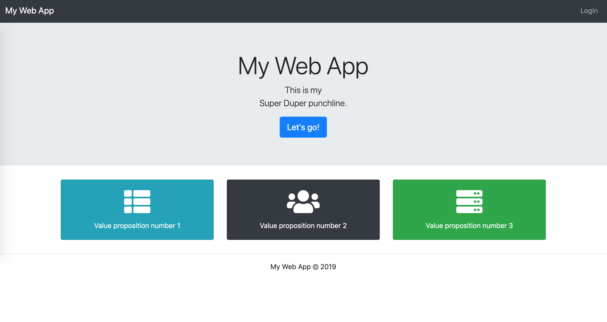

# Web app with username/password login

An example of a web app with username/password login (no emails sent, no email addresses stored).

## Tech stack

- HTML & CSS
- Bootstrap
- Python 3
- Flask
- JavaScript & jQuery
- Google App Engine (2nd Generation Runtime - Python 3)
- Datastore & ndb library

## No emails

This web app does not use any emailing system. Authentication is done via username/password and there's no way to reset 
a password via email.

## The initial setup

When you run the app the first time, there's no user (or admin) in the system yet. So you'll need to navigate to the 
`/registration` URL and register in order to make yourself an admin.

## Running the app via run.py (recommended)

Use **run.py** to run the web app or the tests. 

Right click on this file in PyCharm and select Run. Alternatively, you can run it via the terminal using 
`python run.py`.

### Running manually

You can run everything manually without using run.py.

To run the web app, use these two commands:

    # first run the datastore emulator and wait until it starts
    gcloud beta emulators datastore start --consistency=1 --data-dir=. --project test --host-port "localhost:8001"
    
    # in a new terminal tab start the web app:
    
    # mac & linux
    export FLASK_APP=main.py && flask run --host localhost --port 8080 --reload
    
    # windows
    set FLASK_APP=main.py && flask run --host localhost --port 8080 --reload

For tests run the following (in separate Terminal tabs):

    gcloud beta emulators datastore start --consistency=1 --no-store-on-disk --project test --host-port "localhost:8002"
    
    # mac & linux:
    export TESTING=yes && pytest -p no:warnings
    
    # windows
    set TESTING=yes && pytest -p no:warnings

## See the data in Datastore locally

If you'd like to see what data are stored in the localhost Datastore emulator, install 
[Datastore Viewer](https://github.com/gumo-py/datastore-viewer):

    pip install datastore-viewer

Then you can run the Datastore Viewer using this command:

    # mac & linux:
    export DATASTORE_EMULATOR_HOST=localhost:8001 && datastore-viewer
    
    # windows
    set DATASTORE_EMULATOR_HOST=localhost:8001 && datastore-viewer

Datastore Viewer will run on [http://127.0.0.1:8082/](http://127.0.0.1:8082/). Enter `test` as the project name and 
you'll see the data in your Datastore.
